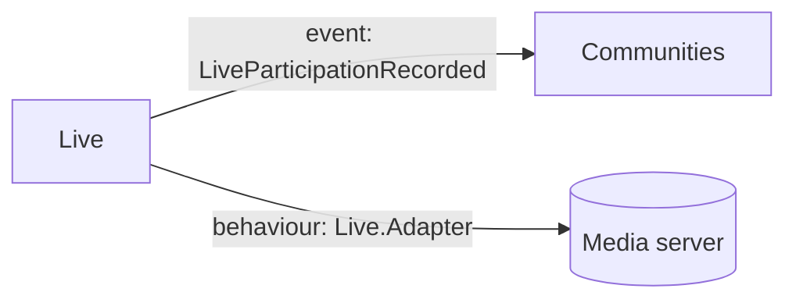

# App

## Features

- [Live sessions](live/live-sessions.md) — runs of an activity's live room, who joined them

## System map

```mermaid
flowchart LR
  Live -- "event: LiveParticipationRecorded" --> Communities
  Live -- "behaviour: Live.Adapter" --> MS[(Media server)]
```
