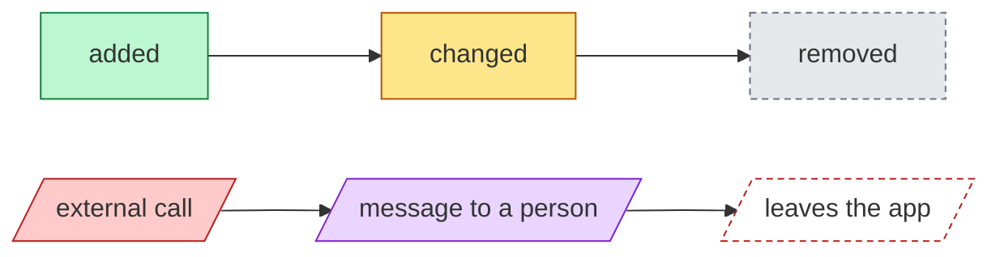
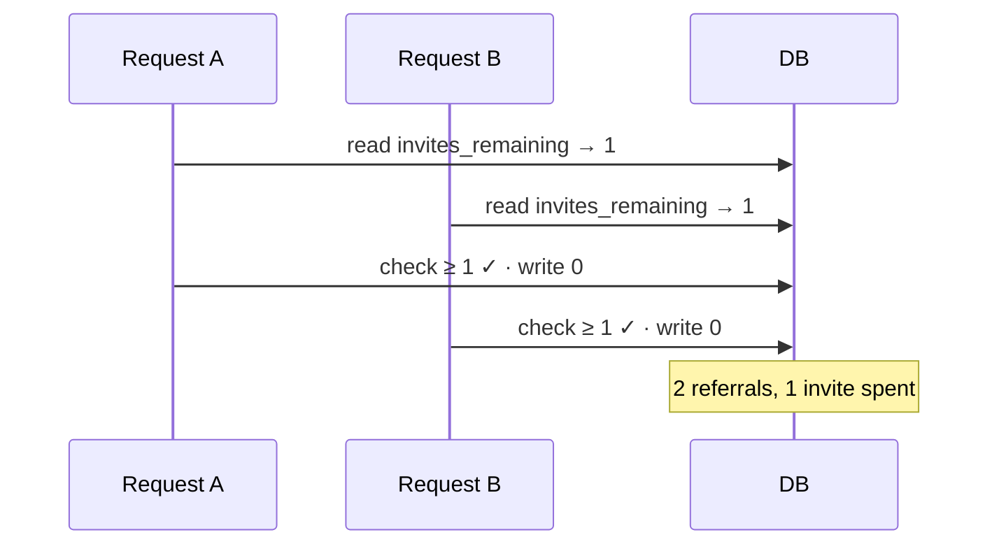
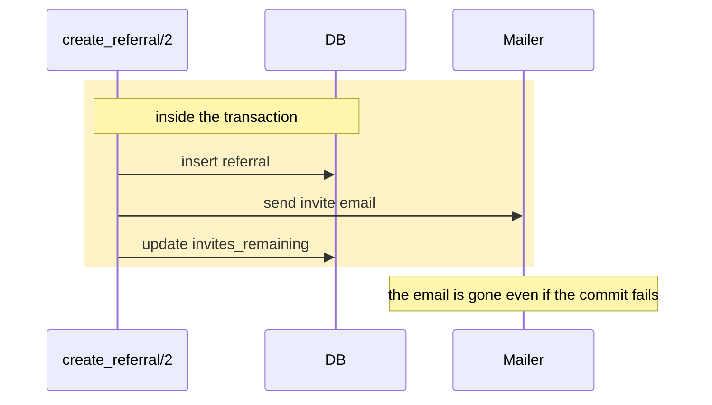
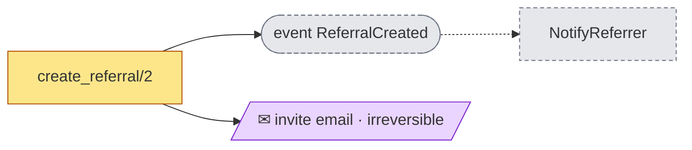
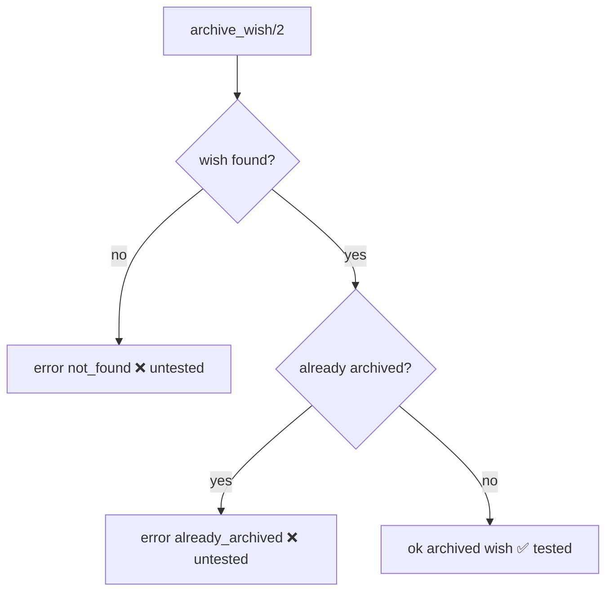
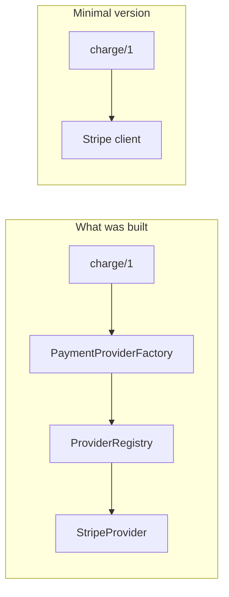
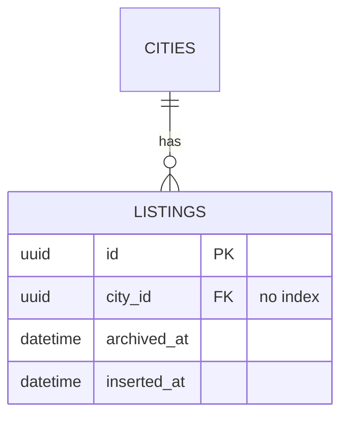
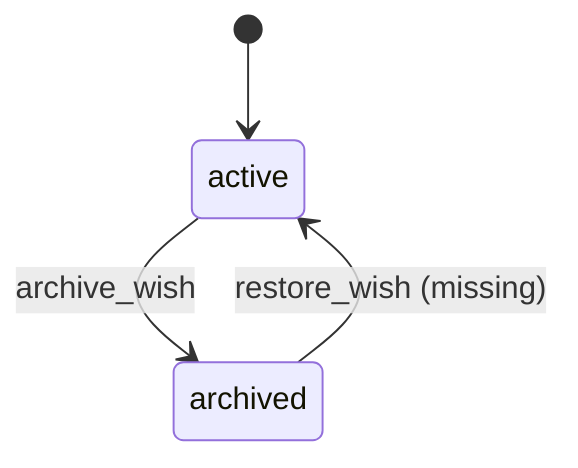
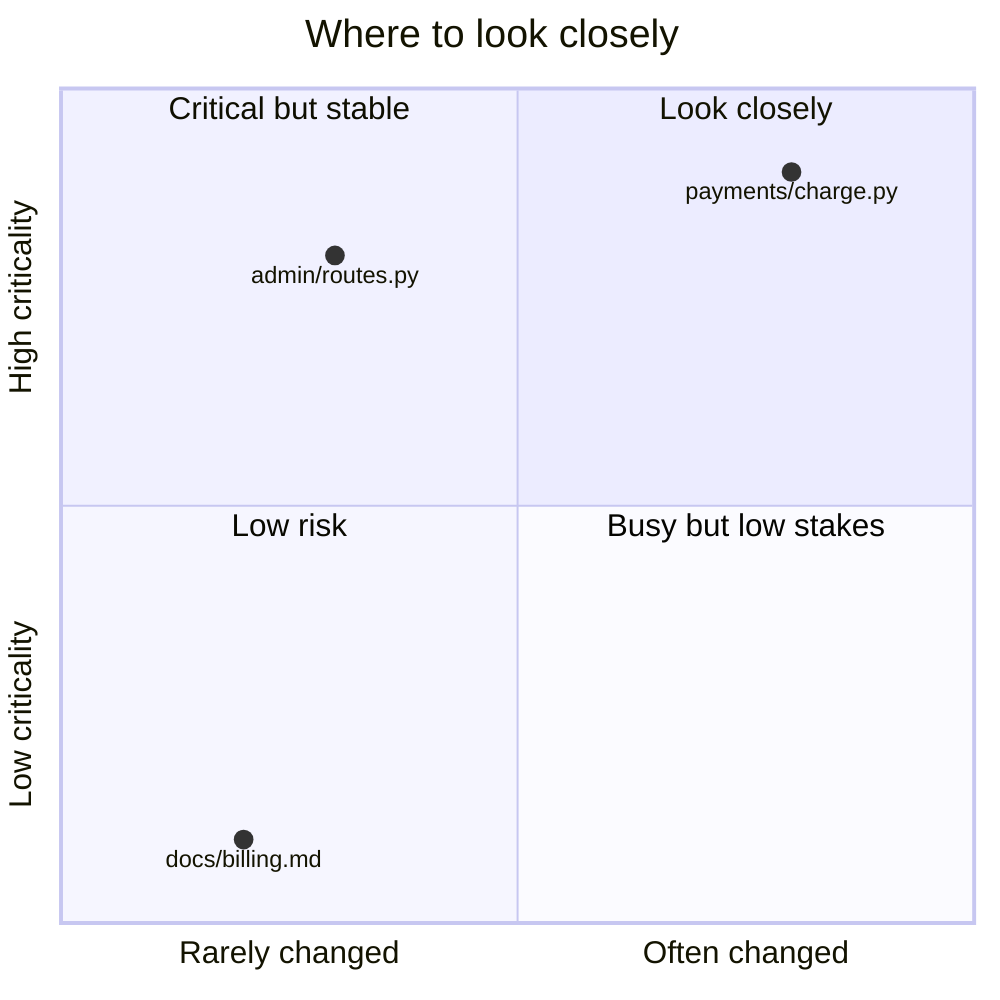

# Diagram guide

Diagrams are mermaid code blocks inside the report. They render on GitHub, in most editors and in the Claude app. Draw one when a picture explains something faster than a sentence; skip it when one sentence is enough.

## Which diagram for which finding

| Finding about | Diagram |
|---|---|
| Race, lost update, duplicate processing, async or cancellation | `sequenceDiagram`: two actors side by side, the failure, then the fixed version |
| Transaction boundaries, effects before or after commit | `sequenceDiagram` with a `rect` around what is inside the transaction |
| Side effects set in motion | `flowchart LR` effect graph with the styles below |
| Missing or untested branch, error path | `flowchart` with each branch marked ✅ or ❌ |
| Layering, boundary or Demeter violation, coupling | Module `flowchart`, offending edge in red |
| Over-complex solution (EP-D12) | Before/after `flowchart`: what was built, and the minimal version |
| Schema or data-model change | `erDiagram`, before and after |
| Lifecycle or status field | `stateDiagram-v2`, the missing or illegal transition highlighted |
| N+1, blocking migration | `sequenceDiagram`: 1 + N round trips next to one batched query; writes waiting on an index build |
| Refactoring suggestion | Before/after `flowchart` or `classDiagram` |
| Risk map | `quadrantChart` |
| Docs impact | `flowchart` from code to doc pages, each page updated, stale or missing |

## Rules

- **Only these diagram types:** `flowchart`, `sequenceDiagram`, `erDiagram`, `stateDiagram-v2`, `classDiagram`, `quadrantChart`. Others may not render everywhere.
- One idea per diagram, at most about 12 nodes.
- Real names from the code (`create_referral/2`, `listings`), never placeholders.
- Put a one-line caption under each diagram saying what to look at, and a legend whenever colours carry meaning.
- Quote every node label that contains spaces, punctuation, parentheses, slashes or emoji: `A["create_referral/2"]`.
- Keep `classDef` names and colours below, so every report reads the same.

## Styles

Legend: green added · amber changed · grey dashed removed · red external call · purple message to a person · red dashed leaves the app.

## Patterns

**Race (two actors, then the fix).**

**Transaction boundary.**

**Effect graph.**

**Untested branches.**

**Minimal solution (EP-D12).**

**Schema change.**

**Lifecycle.**

**Risk map.**

