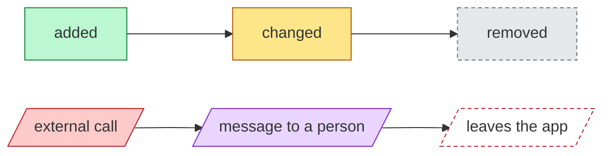
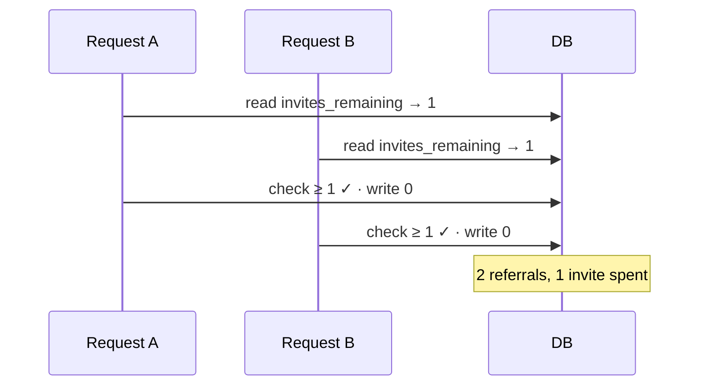
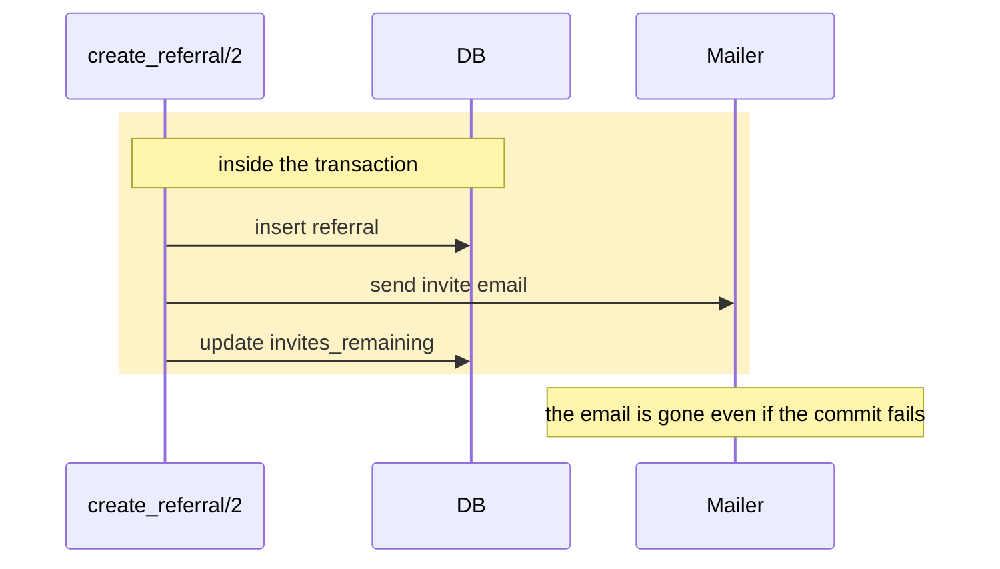
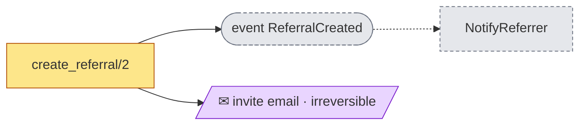
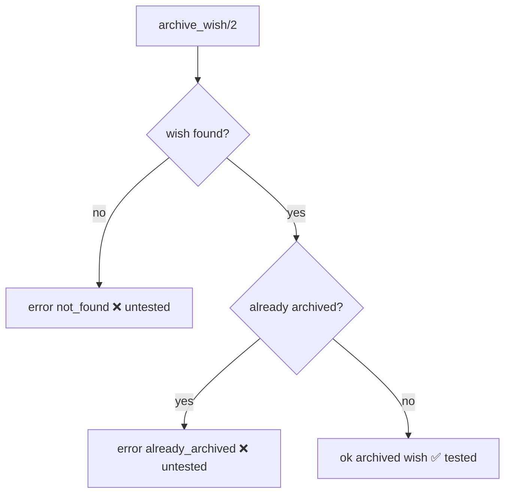
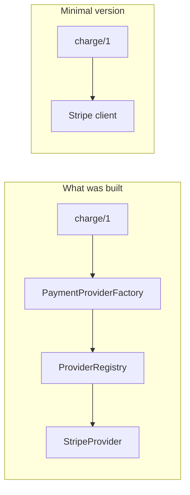
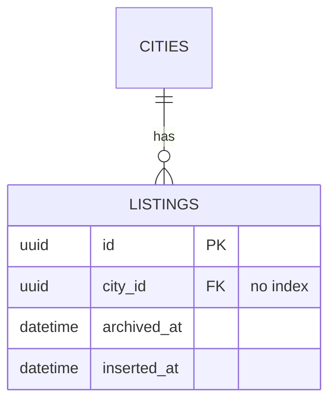
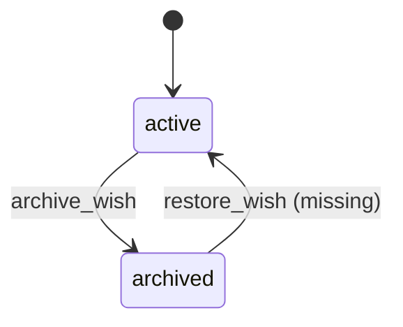
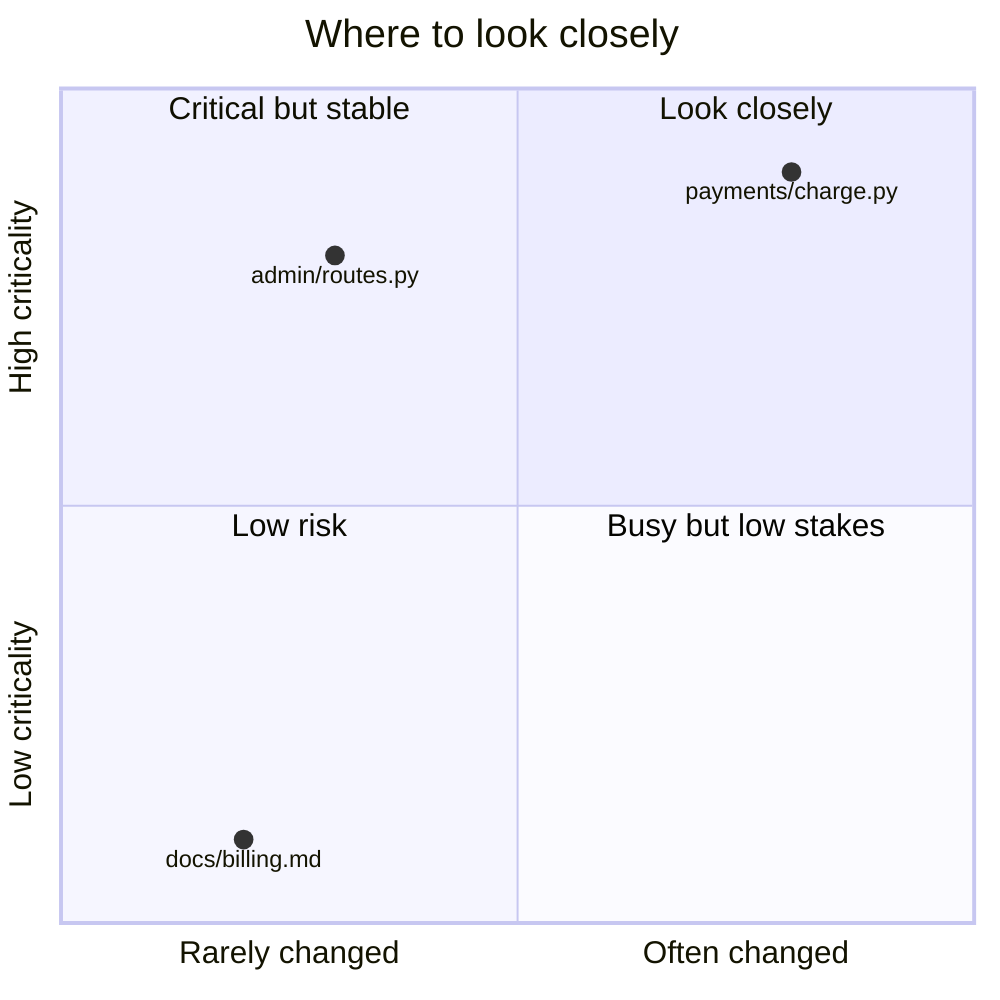

# Review report

Used by `review-companion`. It fixes the shape of the report, the finding card and the diagrams, so every review reads the same.

## Report template

The report is one Markdown file at `.reviews/<YYYY-MM-DD>-<branch-or-PR>.md`, written only after approval at checkpoint 3. Use these headings exactly and in this order; a section with nothing to say says so in one line ("No query changes.") rather than disappearing. Diagrams follow the diagram guide below.

Write for a reader who has not seen the code: plain words, no undefined jargon, present tense. Every finding card must make sense on its own, pasted into a PR comment.

````markdown
# Review — <branch or PR title>

| | |
|---|---|
| Target | `<target>` compared with `<base>` at `<short SHA>` |
| Date | <YYYY-MM-DD> |
| Role of the person asked | author / reviewer |
| Languages and skills applied | <e.g. Elixir — engineering-principles, elixir-phoenix-conventions> |
| Commands run | <each approved command, or "none"> |

> This report supports a human review. It does not approve or reject anything; the decision to merge belongs to the reviewer.

## 1. Summary

<3–5 sentences: what the change does, how it fits, the overall picture of the findings.>

| Severity | Count |
|---|---|
| 🔴 | n |
| 🟠 | n |
| 🟡 | n |
| ❓ | n |

⚡ <n> side effects: <n> new, <n> changed, <n> removed, <n> irreversible, <n> leave the app.

**Look first:** <the three places a human should look at first, each linked to its finding.>

## 2. ⚡ Side effects set in motion

<Effect graph (diagrams.md, "Side effects"), then one row per effect.>

| Effect | Kind | Fires when | Status | Irreversible | User-visible | Tested | Documented | Intended |
|---|---|---|---|---|---|---|---|---|

## 3. The change at a glance

**Intent** (<confirmed by the author | confirmed by the reviewer | not confirmed>): <one paragraph>.

<Change map; the main new flow as a sequence diagram; before/after where behaviour changed; ER or state diagrams where schemas or lifecycles changed.>

## 4. Findings

<Cards grouped by pass, in pass order; inside a pass, most severe first. The format is below.>

## 5. Tests

<Behaviour → test matrix; tests that would still pass if the behaviour broke; test smells; what was run and its result.>

| Behaviour | Test | Would fail if broken? |
|---|---|---|

## 6. Documentation

<Docs impact map; missing pages; each stale passage quoted next to the new behaviour, with a suggested rewrite.>

## 7. Data access & performance

<Query → index table, production numbers with the date they were collected; or "No query or schema changes.">

| Query (where) | Table | Filters · joins · sort | Index that serves it | Rows (prod) | Calls/day | Status |
|---|---|---|---|---|---|---|

## 8. Risk and attention map

<Criticality, change frequency (6 months) and blast radius per touched file; quadrant chart.>

The risk shown here comes from the code only. Weigh who wrote the change, and how familiar they are with this area, yourself.

## 9. Conversation

- **Answers given:** <checkpoint answers, each with who gave it and when>
- **Open questions for the author:** <…>
- **Points to discuss:** <…>
- **Where the intent had to be guessed:** <file:line — why>

## 10. Recommended plan

- [ ] Before merge: <F-NN — one line>
- [ ] Can wait: <F-NN — one line>
- [ ] Needs a decision: <F-NN — one line>

## 11. Limits and decision

- **Not checked:** <tests not run, no production statistics, context the companion could not know, …>
- **Assumptions:** <each conditional finding and the fact it depends on>
- **Before you decide:** <a short checklist for the human: open ❓ items, conditional findings, places they could not explain>

The decision to merge is yours.
````

## Finding card

Every finding uses this card. Fields may not be dropped; write "none" where a field does not apply.

````markdown
### F-NN <🔴|🟠|🟡|❓>[ ⚡] <one sentence stating the consequence, not the rule>
**Pass:** <pass> · **Rules:** `<EP-XN>`[, `<language #N>`] · **Where:** `<file:line>` · **Status:** confirmed | conditional on <fact>

**What.** <What the code does, in plain words.>

**Why it matters.** <A concrete failure scenario with real values: who does what, what happens, what it costs.>

**Evidence.**
```<language>
<at most 10 lines of the code involved>
```

<Diagram, when a picture explains it faster than a sentence — see the diagram guide.>

**Recommendation.**
1. <Step to fix it.>
2. <…>
- **Sketch:** a before/after in the repository's language.
- **Test that proves the fix:** <name and what it asserts>.
- **Doc to update:** <page and section, or "none">.

**Effort:** small | medium | large.
````

Severity:

- 🔴 likely bug, data loss, security issue or broken invariant;
- 🟠 real cost to maintenance or correctness, or an untested behaviour;
- 🟡 minor;
- ❓ a question, not a defect.

Add ⚡ when a triggered side effect is involved. Findings that rest on an unanswered question are `conditional on <fact>`; say what would confirm or clear them.

A ❓ card keeps every field too: **Why it matters** says what goes wrong if the answer is the unwelcome one; **Recommendation** says what to do for each possible answer; **Effort** is the effort of the likely fix.

## Chat summary

After writing the report, post in the chat, in this order:

1. counts by severity;
2. the ⚡ line;
3. the three most important findings, one line each;
4. the three most important open questions;
5. the report path;
6. "The decision to merge is yours."

## Diagram guide

Diagrams are mermaid code blocks inside the report. They render on GitHub, in most editors and in the Claude app. Draw one when a picture explains something faster than a sentence; skip it when one sentence is enough.

### Which diagram for which finding

| Finding about | Diagram |
|---|---|
| Race, lost update, duplicate processing, async or cancellation | `sequenceDiagram`: two actors side by side, the failure, then the fixed version |
| Transaction boundaries, effects before or after commit | `sequenceDiagram` with a `rect` around what is inside the transaction |
| Side effects set in motion | `flowchart LR` effect graph with the styles below |
| Missing or untested branch, error path | `flowchart` with each branch marked ✅ or ❌ |
| Layering, boundary or Demeter violation, coupling | Module `flowchart`, offending edge in red |
| Over-complex solution (EP-D12) | Before/after `flowchart`: what was built, and the minimal version |
| Schema or data-model change | `erDiagram`, before and after |
| Lifecycle or status field | `stateDiagram-v2`, the missing or illegal transition highlighted |
| N+1, blocking migration | `sequenceDiagram`: 1 + N round trips next to one batched query; writes waiting on an index build |
| Refactoring suggestion | Before/after `flowchart` or `classDiagram` |
| Risk map | `quadrantChart` |
| Docs impact | `flowchart` from code to doc pages, each page updated, stale or missing |

### Rules

- **Only these diagram types:** `flowchart`, `sequenceDiagram`, `erDiagram`, `stateDiagram-v2`, `classDiagram`, `quadrantChart`. Others may not render everywhere.
- One idea per diagram, at most about 12 nodes.
- Real names from the code (`create_referral/2`, `listings`), never placeholders.
- Put a one-line caption under each diagram saying what to look at, and a legend whenever colours carry meaning.
- Quote every node label that contains spaces, punctuation, parentheses, slashes or emoji: `A["create_referral/2"]`.
- Keep `classDef` names and colours below, so every report reads the same.

### Styles



Legend: green added · amber changed · grey dashed removed · red external call · purple message to a person · red dashed leaves the app.

### Patterns

**Race (two actors, then the fix).**



**Transaction boundary.**



**Effect graph.**



**Untested branches.**



**Minimal solution (EP-D12).**



**Schema change.**



**Lifecycle.**



**Risk map.**


